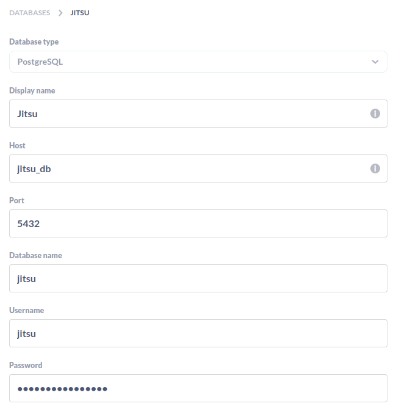

# Metabase and Jitsu

Two independent stacks that 'talk' each other with the configured network: metabase-network
This let Metabase 'see' the postgres database configured inside Jitsu stack.

Both tools use Postgres, so we change de default postgres port on the host for Metabase.

## Installation
Adentro de cada una de las carpetas ejecutamos:

### Download images
```
docker-compose pull
```

### Stop and delete containers
```
docker-compose stop && docker-compose rm
```

### Start containers
```
docker-compose up -d
```

### Considerations

On Metabase, we need to add the same credentials configured on docker-compose.yml for Jitsu. On "Host" we need to specified "container_name", example:

